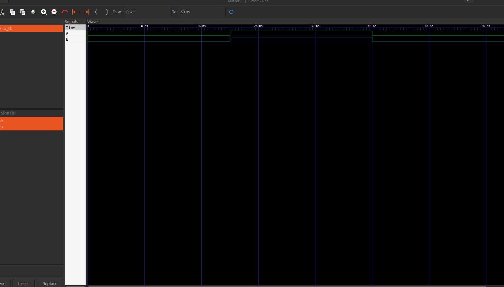

# The repository contains detailed projects of my journey as I master verilog and FPGA projects 

## Architecture 

The current projects are built on `iverilog` and `GTKWave`. 

To run the projects
1. Clone the repo 
    `git clone https://github.com/eric-14/verilog_designs.git`

2. install iverilog
    `sudo apt update  && sudo apt upgrade && sudo apt install iverilog`
3. Install GTKWave 
    `sudo apt install GTKWave`
4. Move the correct folder .e.g. hello_word 
    Create .vvp file from .v file containing the verilog programs 
    ` iverilog -o hello_tb.vvp hello_tb.v`

5. Using vvp run the test file 
    `vvp hello_tb.vvp`

6. Load the generate .vcd file in GTKWave to visualize the results. 

    Example of expected hello world results: 
    

## Contributing.md 

Currently, I am the sole contributor as this is a personal learning journey. 

## Resources 

1. Derek Johnston is an amazing youtuber and has some cool projects on verilog. https://www.youtube.com/@yelhaus/videos
2. HDLBits https://hdlbits.01xz.net/wiki/Main_Page
3. https://www.fpga4student.com/2017/08/what-is-fpga-programming.html
4. I will add more resources, including books as I move along this journey. 

## Purpose of the project

I am heavily learning verilog and I would like to move from a noob to a master in the year 2026. I plan to document my journey in this repo. 
If everything goes as planned, I might participate in a FPGA competition. 

I will start by implementing simple circuits such as adders to master the fundamentals then move to implement communication protocols such as I2C. 
Finally the hallmark of this journey will be to implement a RISC-V CPU. 

## Board 

I am yet to settle on an FPGA board and I am heavily using simulations at the moment. I will decide on the best board as I progress in my journey. 

## License 

Project is licensed under MIT. 

Feel free to clone/fork and reuse the project as you see fit. 

### Wish me luck!
